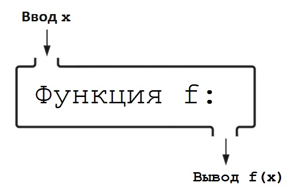

# ЧАСТЬ I Введение в программирование

## Глава 2. Начало работы

### Словарь терминов. Глава 2

**Python:** простой в чтении язык программирования с открытым исходным кодом, который вы научитесь использовать в этой книге. Создан Гвидо ван Россумом и назван в честь британской комедийной труппы «Монти Пайтон».  
**Высокоуровневый язык программирования:** язык программирования, который больше похож на английский, чем язык программирования низкого уровня.  
**Код:** инструкции компьютеру, которые пишут программисты.  
**Низкоуровневый язык программирования:** язык программирования, запись которого ближе к двоичному формату (0 и 1), чем записи языка программирования высокого уровня.  
**Программирование:** написание инструкций, которые выполняет компьютер.  
**Язык ассемблера:** тип трудного для чтения языка программирования.  

## Глава 3. Введение в программирование

### Комментарии

**Комментарий** — это строка (или часть строки) кода, написанная на русском (или любом другом языке), которой предшествует специальный символ, указывающий языку программирования игнорировать эту строку (или часть строки) кода. В Python для создания комментариев используется символ `#`. Пишите комментарий только в том случае, если в своем коде вы делаете чтото необычное или объясняете то, что не является очевидным исходя из самого кода. Используйте комментарии экономно — не комментируйте каждую строку кода — храните их для особых ситуаций.

### Строки кода

Иногда фрагмент кода слишком длинный и не вмещается в одну строку. Код, помещенный в тройные кавычки, круглые, квадратные и фигурные скобки, может быть продолжен на следующей строке.

```python
print("""Это очень очень очень
        очень очень очень длинная
        строка кода.""")
```

Также, чтобы продолжить код на следующей строке, можно использовать символ обратного слеша (`\`).

```python
print\
("""Это очень очень очень очень очень
очень длинная строка кода.""")
```

### Типы данных

Данные в Python сгруппированы в различные категории, называемые **типами данных**. В Python каждое значение, например `2` или `"Hello, world!"`, называется **объектом**.  

`"Hello, world!"` — объект с типом данных **str**. **Символ** — это один знак, вроде `a` или `1`.  
Целые числа (1, 2, 3, 4 и т.д.) имеют тип данных **int**.  
Вещественные числа (числа с десятичной точкой) имеют тип данных **float**.  
Объекты, имеющие тип данных **bool**, называются булевыми или логическими, они принимают значение `True` или `False`.  
Объекты с типом данных **NoneType** всегда имеют значение **None**. Они используются для представления отсутствия значения.  

Часто при программировании необходимо **увеличить** (инкрементировать) или **уменьшить** (декрементировать) значение переменной.

```python
x = 10
x += 1 # 11
x -= 1 # 10
```

### Константы и переменные

**Константа** — это значение, которое никогда не меняется. Каждое число является константой: число два всегда будет представлять значение `2`. **Переменная** же напротив относится к значению, которое может измениться.

Вы можете присваивать переменным любые имена, но должны следовать четырем правилам:

1. Имена переменных не могут содержать пробелы. Если вы хотите использовать в имени два слова, укажите между ними **знак нижнего подчеркивания**: например, `my_variable = "String!"`.
2. Имена переменных могут содержать только **латинские буквы, цифры и символ подчеркивания**.
3. **Нельзя начинать имя переменной с цифры**. И хотя вы можете начинать переменную с подчеркивания.
4. Вы не можете использовать **ключевые слова Python** в качестве имен переменных. Список ключевых слов можно найти по адресу <http://zetcode.com/lang/python/keywords/>.

### Синтаксис

**Синтаксис** — это набор правил, принципов и процессов, которые определяют структуру предложений на определенном языке, в частности, порядок слов. В Python строки всегда берутся в кавычки — это пример синтаксиса Python.

### Ошибки и исключения

У Python есть два типа ошибок: **синтаксические ошибки** и **исключения**. **Исключением** называется любая ошибка, которая не является синтаксической. `ZeroDivisionError` — пример исключения, которое возникает, если вы попытаетесь делить на ноль. Если в своем коде вы неправильно использовали отступы, то получите ошибку `IndentationError`.

### Арифметические операторы

| Оператор | Значение              | Пример  | Результат |
| :------: | :-------------------: | :-----: | :-------: |
|    **    | Возведение в степень  | 2 ** 2  | 4         |
|    %     | Деление по модулю     | 14 % 4  | 2         |
|    //    | Целочисленное деление | 13 // 8 | 1         |
|    /     | Деление               | 13 / 8  | 1.625     |
|    *     | Умножение             | 8 * 2   | 16        |
|    -     | Вычитание             | 7 - 1   | 6         |
|    +     | Сложение              | 2 + 2   | 4         |

Значения (в этом случае числа) по обе стороны от оператора называются **операндами**. Вместе *два операнда* и *оператор* образуют **выражение**.  
**Порядок операций** — это набор правил, используемых для вычисления выражения. Порядок операций в математических равенствах следующий: круглые скобки, возведение в степень, умножение, деление, сложение и вычитание.

### Операторы сравнения

**Операторы сравнения** — иная категория операторов в Python. Подобно арифметическим операторам, они используются в выражениях с операндами с обеих сторон. В отличие от выражений с арифметическими операторами, выражения с операторами сравнения принимают значение `True` или `False`.

| Оператор | Значение         | Пример   | Результат |
| :------: | :--------------: | :------: | :-------: |
|    >     | Больше           | 100 > 10 | True      |
|    <     | Меньше           | 100 < 10 | False     |
|    >=    | Больше или равно | 2 >= 2   | True      |
|    <=    | Меньше или равно | 1 <= 4   | True      |
|    ==    | Равно            | 6 == 9   | False     |
|    !=    | Не равно         | 3 != 2   | True      |

### Логические операторы

**Логические операторы** — еще одна категория операторов в Python. Как и в случае с операторами сравнения, выражения с логическими операторами также принимают значение `True` или `False`.

| Оператор | Значение | Пример        | Результат |
| :------: | :------: | :-----------: | :-------: |
| and      | И        | True and True | True      |
| or       | ИЛИ      | True or False | True      |
| not      | НЕ       | not True      | False     |

### Условные инструкции

Ключевые слова `if, elif` и `else` используются в **условных инструкциях**. Условные инструкции — это тип **структуры управления потоком**: блок кода, который может принимать решения, анализируя значения переменных. Условная инструкция представляет собой код, который может выполнять дополнительный код в зависимости от определенного условия.

### Инструкции

**Инструкция** — это технический термин, описывающий различные части языка Python. Можете рассматривать инструкцию Python как команду или вычисление.  
В Python есть два вида инструкций: **простые** и **составные**. Простые инструкции могут быть выражены в одной строке кода, тогда как составные обычно занимают несколько строк.  
Составные инструкции состоят из одной или нескольких **ветвей**. Ветвь состоит из двух или более строк кода: **заголовка**, за которым следует **тело**. Заголовок представляет собой строку кода в ветви, содержащую ключевое слово, за которым следует двоеточие, и последовательность из одной или нескольких строк с отступом. После отступа содержится тело, состоящее из одной или двух простых инструкций. Тело — это всего лишь строка кода внутри ветви. Заголовок управляет телом. Наша программа, выводящая `Hello, world` сто раз, состоит из одной составной инструкции.

```python
# Составная инструкция
for i in range(100):              # Заголовок
        print("Hello, world!")    # Тело
```

### Словарь терминов. Глава 3

**Bool**: тип данных логических объектов.  
**Float**: тип данных вещественных чисел (чисел с десятичной точкой).  
**Int**: тип данных целых чисел.  
**None**: объект с типом данных `NoneType`. Его значением всегда является `None`.  
**NoneType**: тип данных объектов `None`.  
**Str**: тип данных строки.  
**Арифметический оператор**: категория операторов, используемых в арифметических выражениях.  
**Ветвь**: строительные блоки составных инструкций. Ветвь состоит из двух или более строк кода: заголовка, за которым следует тело.  
**Выражение**: код с оператором между двумя операндами.  
**Декрементирование**: уменьшение значение переменной.  
**Заголовок**: строка кода в ветви, содержащая ключевое слово, за которым следует двоеточие, и последовательность из одной или нескольких строк с отступом.  
**Инкрементирование**: увеличение значения переменной.  
**Инструкция elif**: инструкции, которые можно бесконечно добавлять в инструкцию `if-else`, позволяя последней принимать дополнительные решения.  
**Инструкция else**: вторая часть инструкции `if-else`.  
**Инструкция if**: первая часть инструкции `if-else`.  
**Инструкция if-else**: способ, которым программисты говорят «если это произойдет, сделайте это, в противном случае сделайте то».  
**Инструкция**: команда или вычисление.  
**Исключение**: ошибка, не являющаяся фатальной.  
**Ключевое слово**: слово в языке программирования, имеющее особый смысл.  
Все ключевые слова Python можно найти на сайте **theselftaughtprogrammer.io/keywords**.  
**Комментарий**: строка (или часть строки) кода, написанная на русском (или другом) языке, которой предшествует специальный символ, сообщающий используемому вами языку программирования, что эту строку (или часть строки) кода следует проигнорировать.  
**Константа**: значение, которое никогда не изменяется.  
**Логический оператор**: категория операторов, оценивающих значения двух выражений и возвращающих либо `True`, либо `False`.  
**Логический**: объект с типом данных `bool`. Его значением является либо `True` (истина), либо `False` (ложь).  
**Объект**: значение с тремя свойствами: идентификатором, типом данных и значением.  
**Операнд**: значение с любой стороны от оператора.  
**Оператор присваивания**: символ = в Python.  
**Оператор сравнения**: категория операторов, которые используются в выражении, принимающем значение либо `True` (истина), либо `False` (ложь).  
**Оператор**: символы, использующиеся в выражении с операндами.  
**Переменная**: имя, которому с помощью оператора присваивания присвоено значение.  
**Порядок операций**: набор правил, используемых в математике при подсчете выражений.  
**Простая инструкция**: инструкция, которую можно выразить с помощью одной строки кода.  
**Псевдокод**: ненастоящий код, используемый для иллюстрации примера.  
**Символ**: один знак, например `a` или `1`.  
**Синтаксис**: комплекс правил, принципов и процессов, определяющих структуру предложений в данном языке, в частности, [порядок слов][1].  
**Синтаксическая ошибка**: фатальная ошибка в программировании, вызванная нарушением синтаксиса языка программирования.  
**Составная инструкция**: инструкция, обычно занимающая больше одной строки кода.  
**Строка**: объект с типом данных `str`. Значением строки является последовательность одного или больше символов, помещенных в кавычки.  
**Структура управления потоком**: блок кода, который принимает решения, анализируя значения переменных.  
**Тело**: строка кода внутри ветви, которой управляет заголовок.  
**Тип данных**: категория данных.  
**Условная инструкция**: код, выполняющий дополнительный код при наступлении определенных условий.  
**Целое**: объект с типом данных `int`. Его значением является целое число.  
**Число с плавающей точкой**: объект с типом данных `float`. Его значением является вещественное число (число с десятичной точкой).  

[1]: https://stackoverflow.com/questions/1031273/what-is-polymorphism-what-is-it-for-and-how-is-it-used

## Глава 4. Функции

> Функции должны делать одну вещь и делать ее хорошо и делать только ее.
> *Роберт С. Мартин*

|                                  |
| :-------------------------------:|
|  | 

### Функции

Вызвать функцию — значит передать ей данные ввода, необходимые для выполнения указаний и возвращения вывода. Каждый 
ввод в функцию является параметром . Когда вы передаете функции параметр, это называется передача параметра функции. 
Как в Python, так и в алгебре, функция записывается следующим образом: *имя_функции(параметры_через_запятую)*.

### Определение функций

```python
def имя_функции(параметры):
    определение_функции
```

функция не обязана содержать инструкцию `return`. Если функции нечего возвращать, она возвращает значение `None`.

```python
def f():
    z = 1 + 1
    
result = f()
print(result)

>> None
```
