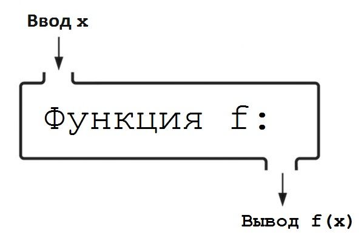

# ЧАСТЬ I Введение в программирование

<!-- TOC -->

- [ЧАСТЬ I Введение в программирование](#часть-i-введение-в-программирование)
    - [Глава 2. Начало работы](#глава-2-начало-работы)
        - [Словарь терминов. Глава 2](#словарь-терминов-глава-2)
    - [Глава 3. Введение в программирование](#глава-3-введение-в-программирование)
        - [Комментарии](#комментарии)
        - [Строки кода](#строки-кода)
        - [Типы данных](#типы-данных)
        - [Константы и переменные](#константы-и-переменные)
        - [Синтаксис](#синтаксис)
        - [Ошибки и исключения](#ошибки-и-исключения)
        - [Арифметические операторы](#арифметические-операторы)
        - [Операторы сравнения](#операторы-сравнения)
        - [Логические операторы](#логические-операторы)
        - [Условные инструкции](#условные-инструкции)
        - [Инструкции](#инструкции)
        - [Словарь терминов. Глава 3](#словарь-терминов-глава-3)
    - [Глава 4. Функции](#глава-4-функции)
        - [Функции](#функции)
        - [Определение функций](#определение-функций)
        - [Встроенные функции](#встроенные-функции)
        - [Обязательные и необязательные параметры](#обязательные-и-необязательные-параметры)
        - [Область видимости](#область-видимости)
        - [Обработка исключений](#обработка-исключений)
        - [Строки документации](#строки-документации)
        - [Используйте переменные, только когда это необходимо](#используйте-переменные-только-когда-это-необходимо)
        - [Словарь терминов. Глава 4](#словарь-терминов-глава-4)
    - [Глава 5. Контейнеры](#глава-5-контейнеры)
        - [Методы](#методы)
        - [Списки](#списки)
        - [Кортежи](#кортежи)
        - [Словари](#словари)
        - [Контейнеры внутри контейнеров](#контейнеры-внутри-контейнеров)
        - [Словарь терминов. Глава 5](#словарь-терминов-глава-5)
    - [Глава 6. Операции со строками](#глава-6-операции-со-строками)
        - [Тройные строки](#тройные-строки)
        - [Индексы](#индексы)
        - [Строки неизменяемы](#строки-неизменяемы)
        - [Конкатенация](#конкатенация)
        - [Умножение строк](#умножение-строк)
        - [Изменение регистра](#изменение-регистра)
        - [Метод `format`](#метод-format)
        - [Метод `split`](#метод-split)
        - [Метод `join`](#метод-join)
        - [Метод `strip`](#метод-strip)
        - [Метод `replace`](#метод-replace)
        - [Поиск индекса](#поиск-индекса)
        - [Ключевое слово `in`](#ключевое-слово-in)
        - [Управляющие символы](#управляющие-символы)
        - [Новая строка](#новая-строка)
        - [Извлечение среза](#извлечение-среза)
        - [Словарь терминов Глава 6](#словарь-терминов-глава-6)
    - [Глава 7. Циклы](#глава-7-циклы)
        - [Циклы `for`](#циклы-for)
        - [Функция `range`](#функция-range)
        - [Циклы `while`](#циклы-while)
        - [Инструкция `break`](#инструкция-break)
        - [Инструкция `continue`](#инструкция-continue)
        - [Словарь терминов Глава 7](#словарь-терминов-глава-7)
    - [Глава 8. Модули](#глава-8-модули)
        - [Импорт встроенных модулей](#импорт-встроенных-модулей)
        - [Импорт других модулей](#импорт-других-модулей)
        - [Словарь терминов Глава 8](#словарь-терминов-глава-8)
    - [Глава 9. Файлы](#глава-9-файлы)
        - [Запись в файлы](#запись-в-файлы)
        - [Автоматическое закрытие файлов](#автоматическое-закрытие-файлов)
        - [Чтение из файлов](#чтение-из-файлов)
        - [CSV-файлы](#csv-файлы)
        - [Словарь терминов Глава 9](#словарь-терминов-глава-9)
    - [Глава 10. Практикум. Часть I](#глава-10-практикум-часть-i)
    - [Глава 11. Дополнительная информация](#глава-11-дополнительная-информация)
        - [Для прочтения](#для-прочтения)
        - [Другие ресурсы](#другие-ресурсы)

<!-- /TOC -->

## Глава 2. Начало работы

### Словарь терминов. Глава 2

**Python:** простой в чтении язык программирования с открытым исходным кодом, который вы научитесь использовать в этой книге. Создан Гвидо ван Россумом и назван в честь британской комедийной труппы «Монти Пайтон».  
**Высокоуровневый язык программирования:** язык программирования, который больше похож на английский, чем язык программирования низкого уровня.  
**Код:** инструкции компьютеру, которые пишут программисты.  
**Низкоуровневый язык программирования:** язык программирования, запись которого ближе к двоичному формату (0 и 1), чем записи языка программирования высокого уровня.  
**Программирование:** написание инструкций, которые выполняет компьютер.  
**Язык ассемблера:** тип трудного для чтения языка программирования.  

## Глава 3. Введение в программирование

### Комментарии

**Комментарий** — это строка (или часть строки) кода, написанная на русском (или любом другом языке), которой предшествует специальный символ, указывающий языку программирования игнорировать эту строку (или часть строки) кода. В Python для создания комментариев используется символ `#`. Пишите комментарий только в том случае, если в своем коде вы делаете чтото необычное или объясняете то, что не является очевидным исходя из самого кода. Используйте комментарии экономно — не комментируйте каждую строку кода — храните их для особых ситуаций.

### Строки кода

Иногда фрагмент кода слишком длинный и не вмещается в одну строку. Код, помещенный в тройные кавычки, круглые, квадратные и фигурные скобки, может быть продолжен на следующей строке.

```python
print("""Это очень очень очень
        очень очень очень длинная
        строка кода.""")
```

Также, чтобы продолжить код на следующей строке, можно использовать символ обратного слеша (`\`).

```python
print\
("""Это очень очень очень очень очень
очень длинная строка кода.""")
```

### Типы данных

Данные в Python сгруппированы в различные категории, называемые **типами данных**. В Python каждое значение, например `2` или `"Hello, world!"`, называется **объектом**.  

`"Hello, world!"` — объект с типом данных **str**. **Символ** — это один знак, вроде `a` или `1`.  
Целые числа (1, 2, 3, 4 и т.д.) имеют тип данных **int**.  
Вещественные числа (числа с десятичной точкой) имеют тип данных **float**.  
Объекты, имеющие тип данных **bool**, называются булевыми или логическими, они принимают значение `True` или `False`.  
Объекты с типом данных **NoneType** всегда имеют значение **None**. Они используются для представления отсутствия значения.  

Часто при программировании необходимо **увеличить** (инкрементировать) или **уменьшить** (декрементировать) значение переменной.

```python
x = 10
x += 1 # 11
x -= 1 # 10
```

### Константы и переменные

**Константа** — это значение, которое никогда не меняется. Каждое число является константой: число два всегда будет представлять значение `2`. **Переменная** же напротив относится к значению, которое может измениться.

Вы можете присваивать переменным любые имена, но должны следовать четырем правилам:

1. Имена переменных не могут содержать пробелы. Если вы хотите использовать в имени два слова, укажите между ними **знак нижнего подчеркивания**: например, `my_variable = "String!"`.
2. Имена переменных могут содержать только **латинские буквы, цифры и символ подчеркивания**.
3. **Нельзя начинать имя переменной с цифры**. И хотя вы можете начинать переменную с подчеркивания.
4. Вы не можете использовать **ключевые слова Python** в качестве имен переменных. Список ключевых слов можно найти по адресу <http://zetcode.com/lang/python/keywords/>.

### Синтаксис

**Синтаксис** — это набор правил, принципов и процессов, которые определяют структуру предложений на определенном языке, в частности, порядок слов. В Python строки всегда берутся в кавычки — это пример синтаксиса Python.

### Ошибки и исключения

У Python есть два типа ошибок: **синтаксические ошибки** и **исключения**. **Исключением** называется любая ошибка, которая не является синтаксической. `ZeroDivisionError` — пример исключения, которое возникает, если вы попытаетесь делить на ноль. Если в своем коде вы неправильно использовали отступы, то получите ошибку `IndentationError`.

### Арифметические операторы

| Оператор | Значение              | Пример  | Результат |
| :------: | :-------------------: | :-----: | :-------: |
| **       | Возведение в степень  | 2 ** 2  | 4         |
| %        | Деление по модулю     | 14 % 4  | 2         |
| //       | Целочисленное деление | 13 // 8 | 1         |
| /        | Деление               | 13 / 8  | 1.625     |
| *        | Умножение             | 8 * 2   | 16        |
| -        | Вычитание             | 7 - 1   | 6         |
| +        | Сложение              | 2 + 2   | 4         |

Значения (в этом случае числа) по обе стороны от оператора называются **операндами**. Вместе *два операнда* и *оператор* образуют **выражение**.  
**Порядок операций** — это набор правил, используемых для вычисления выражения. Порядок операций в математических равенствах следующий: круглые скобки, возведение в степень, умножение, деление, сложение и вычитание.

### Операторы сравнения

**Операторы сравнения** — иная категория операторов в Python. Подобно арифметическим операторам, они используются в выражениях с операндами с обеих сторон. В отличие от выражений с арифметическими операторами, выражения с операторами сравнения принимают значение `True` или `False`.

| Оператор | Значение         | Пример   | Результат |
| :------: | :--------------: | :------: | :-------: |
| >        | Больше           | 100 > 10 | True      |
| <        | Меньше           | 100 < 10 | False     |
| >=       | Больше или равно | 2 >= 2   | True      |
| <=       | Меньше или равно | 1 <= 4   | True      |
| ==       | Равно            | 6 == 9   | False     |
| !=       | Не равно         | 3 != 2   | True      |

### Логические операторы

**Логические операторы** — еще одна категория операторов в Python. Как и в случае с операторами сравнения, выражения с логическими операторами также принимают значение `True` или `False`.

| Оператор | Значение | Пример        | Результат |
| :------: | :------: | :-----------: | :-------: |
| and      | И        | True and True | True      |
| or       | ИЛИ      | True or False | True      |
| not      | НЕ       | not True      | False     |

### Условные инструкции

Ключевые слова `if, elif` и `else` используются в **условных инструкциях**. Условные инструкции — это тип **структуры управления потоком**: блок кода, который может принимать решения, анализируя значения переменных. Условная инструкция представляет собой код, который может выполнять дополнительный код в зависимости от определенного условия.  

### Инструкции

**Инструкция** — это технический термин, описывающий различные части языка Python. Можете рассматривать инструкцию Python как команду или вычисление.  
В Python есть два вида инструкций: **простые** и **составные**. Простые инструкции могут быть выражены в одной строке кода, тогда как составные обычно занимают несколько строк.  

```python
# Составная инструкция
for i in range(100):              # Заголовок
        print("Hello, world!")    # Тело
```

Составные инструкции состоят из одной или нескольких **ветвей**. Ветвь состоит из двух или более строк кода: **заголовка**, за которым следует **тело**. Заголовок представляет собой строку кода в ветви, содержащую ключевое слово, за которым следует двоеточие, и последовательность из одной или нескольких строк с отступом. После отступа содержится тело, состоящее из одной или двух простых инструкций. Тело — это всего лишь строка кода внутри ветви. Заголовок управляет телом. Наша программа, выводящая `Hello, world` сто раз, состоит из одной составной инструкции.  

### Словарь терминов. Глава 3

**Bool**: тип данных логических объектов.  
**Float**: тип данных вещественных чисел (чисел с десятичной точкой).  
**Int**: тип данных целых чисел.  
**None**: объект с типом данных `NoneType`. Его значением всегда является `None`.  
**NoneType**: тип данных объектов `None`.  
**Str**: тип данных строки.  
**Арифметический оператор**: категория операторов, используемых в арифметических выражениях.  
**Ветвь**: строительные блоки составных инструкций. Ветвь состоит из двух или более строк кода: заголовка, за которым следует тело.  
**Выражение**: код с оператором между двумя операндами.  
**Декрементирование**: уменьшение значение переменной.  
**Заголовок**: строка кода в ветви, содержащая ключевое слово, за которым следует двоеточие, и последовательность из одной или нескольких строк с отступом.  
**Инкрементирование**: увеличение значения переменной.  
**Инструкция elif**: инструкции, которые можно бесконечно добавлять в инструкцию `if-else`, позволяя последней принимать дополнительные решения.  
**Инструкция else**: вторая часть инструкции `if-else`.  
**Инструкция if**: первая часть инструкции `if-else`.  
**Инструкция if-else**: способ, которым программисты говорят «если это произойдет, сделайте это, в противном случае сделайте то».  
**Инструкция**: команда или вычисление.  
**Исключение**: ошибка, не являющаяся фатальной.  
**Ключевое слово**: слово в языке программирования, имеющее особый смысл.  
Все ключевые слова Python можно найти на сайте **theselftaughtprogrammer.io/keywords**.  
**Комментарий**: строка (или часть строки) кода, написанная на русском (или другом) языке, которой предшествует специальный символ, сообщающий используемому вами языку программирования, что эту строку (или часть строки) кода следует проигнорировать.  
**Константа**: значение, которое никогда не изменяется.  
**Логический оператор**: категория операторов, оценивающих значения двух выражений и возвращающих либо `True`, либо `False`.  
**Логический**: объект с типом данных `bool`. Его значением является либо `True` (истина), либо `False` (ложь).  
**Объект**: значение с тремя свойствами: идентификатором, типом данных и значением.  
**Операнд**: значение с любой стороны от оператора.  
**Оператор присваивания**: символ = в Python.  
**Оператор сравнения**: категория операторов, которые используются в выражении, принимающем значение либо `True` (истина), либо `False` (ложь).  
**Оператор**: символы, использующиеся в выражении с операндами.  
**Переменная**: имя, которому с помощью оператора присваивания присвоено значение.  
**Порядок операций**: набор правил, используемых в математике при подсчете выражений.  
**Простая инструкция**: инструкция, которую можно выразить с помощью одной строки кода.  
**Псевдокод**: ненастоящий код, используемый для иллюстрации примера.  
**Символ**: один знак, например `a` или `1`.  
**Синтаксис**: комплекс правил, принципов и процессов, определяющих структуру предложений в данном языке, в частности, [порядок слов][1].  
**Синтаксическая ошибка**: фатальная ошибка в программировании, вызванная нарушением синтаксиса языка программирования.  
**Составная инструкция**: инструкция, обычно занимающая больше одной строки кода.  
**Строка**: объект с типом данных `str`. Значением строки является последовательность одного или больше символов, помещенных в кавычки.  
**Структура управления потоком**: блок кода, который принимает решения, анализируя значения переменных.  
**Тело**: строка кода внутри ветви, которой управляет заголовок.  
**Тип данных**: категория данных.  
**Условная инструкция**: код, выполняющий дополнительный код при наступлении определенных условий.  
**Целое**: объект с типом данных `int`. Его значением является целое число.  
**Число с плавающей точкой**: объект с типом данных `float`. Его значением является вещественное число (число с десятичной точкой).  

[1]: https://stackoverflow.com/questions/1031273/what-is-polymorphism-what-is-it-for-and-how-is-it-used

## Глава 4. Функции

> Функции должны делать одну вещь и делать ее хорошо и делать только ее.
> *Роберт С. Мартин*



### Функции

Вызвать функцию — значит передать ей данные ввода, необходимые для выполнения указаний и возвращения вывода. Каждый ввод в функцию является параметром . Когда вы передаете функции параметр, это называется передача параметра функции. Как в Python, так и в алгебре, функция записывается следующим образом: *имя_функции(параметры_через_запятую)*.

### Определение функций

```python
def имя_функции(параметры):
    определение_функции
```

функция не обязана содержать инструкцию `return`. Если функции нечего возвращать, она возвращает значение `None`.

```python
def f():
    z = 1 + 1

result = f()
print(result)

>> None
```

### Встроенные функции

Python содержит библиотеку функций, встроенных в язык программирования. Они называются **встроенными функциями**.  
`len` — встроенная функция. Она возвращает длину объекта – например, строки (т.е. количество символов в ней).  
Встроенная функция `str` принимает объект и возвращает новый объект с типом данных `str`.  
Функция `int` принимает объект и возвращает его в виде целого числа.  
Функция `float` принимает объект и возвращает число с плавающей точкой.  
Если вы попытаетесь передать функции `int` или `float` параметр, который нельзя преобразовать в целое число или число с плавающей точкой, Python сгенерирует исключение (`ValueError`). Например, *ValueError: invalid literal for int() with base 10: 'Prince'*
`input` — это встроенная функция, собирающая информацию от человека, который использует программу. Функция input собирает данные от пользователя в виде `str`.  

### Обязательные и необязательные параметры

Функция может принимать параметры двух типов. Те, что встречались вам до этого, называются **обязательными параметрами**. Когда пользователь вызывает функцию, он должен передать в нее все обязательные параметры, иначе Python сгенерирует исключение.  
В Python есть и другой вид параметров — **опциональные**. Они позволяют тому, кто вызвал функцию, при необходимости передать в нее параметр, но он не является обязательным. Опциональные параметры определяются с помощью следующего синтаксиса: *имя_функции(имя_параметра = значение_параметра)*.  
Вы можете определить функцию, которая принимает как обязательные, так и опциональные параметры, но обязательные нужно определять в первую очередь.  
`ValueError: invalid literal for int() with base 10: '7.8'`

### Область видимости

У переменных есть важное свойство, называемое **областью видимости**. Если вы определили ее за пределами функции (или класса), область видимости переменной — **глобальная**. Тогда значение переменной можно найти и изменить из любой позиции программы. Переменная с глобальной областью видимости называется **глобальной переменной**. Если вы определите переменную в пределах функции (или класса), у нее будет **локальная область видимости**: ваша программа сможет найти и изменить значение переменной только в функции, в пределах которой она была определена.  
`NameError: name 'x' is not defined`  
Вы можете изменять глобальную переменную откуда угодно, но для ее изменения внутри локальной области видимости требуется дополнительный шаг. Перед переменной, которую вы желаете изменить, необходимо использовать ключевое слово `global`.

```python
x = 100

def f():
    global x
    x += 1
    print(x)

f()

>> 101
```

### Обработка исключений

`ZeroDivisionError: integer division or modulo by zero`  
Способом выйти из положения может считаться обработка исключений — она позволит вам протестировать программу на возможные ошибки, «перехватить» исключения , если таковые возникают, и решить, что делать дальше.  
Список встроенных исключений можете найти на странице в Интернете по адресу <https://goo.gl/A2Utav>.  
Для обработки исключений используются ключевые слова `try` и `except`. Ветвь `try` содержит возможную ошибку. Ветвь `except` содержит код, который будет выполняться лишь в том случае, если в ветви `try` появится исключение.  
Исключение `ValueError` возникает, если вы передаете встроенным функциям `int`, `string`, или `float` неверный ввод.  

```python
try:
    a = input("enter the number: ")
    b = input("enter one more")
    a = int(a)
    b = int(b)
    print(a / b)
except (ZeroDivisionError, ValueError):
    print("Input Error. Inter the number, except Zero, not String!")
```

Не используйте в инструкции except переменные, определенные в инструкции try, поскольку исключение может возникнуть прежде, чем будет определена переменная, и как только вы попытаетесь использовать инструкцию except, внутри нее сгенерируется исключение.

```python
try:
    10 / 0
    c = "I will never be defined"
except ZeroDivisionError:
    print(c)

>> NameError: name 'c' is not defined
```

### Строки документации

Когда пишете функцию, вверху не помешает оставить комментарий, называемый **строкой документации**, чтобы объяснить, какой тип данных должен иметь каждый параметр. Строки документации объясняют, что делает функция, и какие она требует параметры.  

### Используйте переменные, только когда это необходимо

Сохраняйте данные в переменной, только если собираетесь затем ее использовать. К примеру, не сохраняйте в переменной целое число, чтобы просто вывести его.

```python
# Not to do
x = 100
print(x)

# OK
print(100)
```

### Словарь терминов. Глава 4

**Встроенная функция**: функция, поставляющаяся с Python.  
**Вызов**: передача функции вводных данных, необходимые для выполнения указаний и возвращения вывода.  
**Глобальная область видимости**: область видимости переменной, которую можно найти и изменить откуда угодно в программе.  
**Глобальная переменная**: переменная с глобальной областью видимости.  
**Локальная область видимости**: область видимости переменной, которую можно найти и изменить только из функции (или класса), внутри которой переменная была определена.  
**Область видимости**: то, где переменную можно найти и изменить.  
**Обработка исключений**: концепция программирования, позволяющая вам тестировать программу на возможные ошибки, «перехватывать» исключения, если таковые возникают, и решать, что делать дальше.  
**Обязательный параметр**: необходимый параметр.  
**Опциональный параметр**: необязательный параметр.  
**Параметр**: данные, переданные в функцию.  
**Соглашение**: согласованный способ делать что-то.  
**Строка документации**: объясняет, что делает функция, и какие она требует параметры.  
**Функции**: составные инструкции, которые могут принимать данные ввода, выполнять указания и возвращать данные вывода.  

## Глава 5. Контейнеры

> Где дурак удивленно размышляет, мудрец спрашивает.
> *Бенджамин Дизраэли*

### Методы

**Методы** — это функции, тесно связанные с определенным типом данных. Они могут выполнять код и возвращать результат как функции, но, в отличие от последних, методы *вызываются с объектами*. Вы также можете передавать им параметры.  

### Списки

**Список** — это контейнер, хранящий объекты в определенном порядке.  

  

Создать список можно двумя способами. Во-первых, пустой список создается при помощи функции `list`.  
Или можно просто использовать `квадратные скобки`.  

```python
# 1 способ
fruit = list()
# 2 способ
fruit = []
```

Вы можете создавать списки сразу с элементами в них, используя синтаксис `[]` и помещая внутрь скобок каждый желаемый элемент через запятую.  

```python
fruit = ["Apple", "Orange", "Banana"]
```

Добавление в список нового элемента осуществляется с помощью метода `append`. Метод `append` всегда добавляет новый элемент в конец списка.  
В списках можно хранить *любой тип данных*, не только строки.  
Строки, списки и кортежи поддерживают **итерирование** (программа может их перебирать, значение за значением), то есть к каждому их элементу можно получить доступ через цикл — такие объекты называются **итерируемыми**. Каждый элемент в итерируемом объекте имеет **индекс** — число, представляющее позицию элемента в этом объекте. Индекс первого элемента в списке — `0`, а не `1`.  
Вы можете обратиться к элементу при помощи его индекса, используя синтаксис *имя_списка[индекс]*.  
Если вы попытаетесь получить доступ к несуществующему индексу, Python сгенерирует исключение `IndexError: list index out of range`.  
Списки **изменяемы**. Когда контейнер является изменяемым, это значит, что вы можете добавлять в него объекты или удалять их. Изменить объект в списке можно, присвоив его индекс новому объекту.  
С помощью метода `pop` можно *удалить* последний элемент в списке. Нельзя использовать pop с пустым списком. В этом случае Python сгенерирует исключение.  
При помощи оператора сложения можно *соединять* два списка.  
Проверить, *есть ли элемент* в списке, можно с помощью ключевого слова `in`.  
Для проверки *отсутствия элемента* в списке используйте ключевое слово `not`.  
С помощью функции `len` можно узнать длину списка, то есть количество его элементов.  

### Кортежи

**Кортеж** — это контейнер, хранящий объекты в определенном порядке. В отличие от списков, кортежи **неизменяемы**, то есть их содержимое нельзя изменить. Как только вы создали кортеж, значение какого-либо его элемента уже нельзя изменить, как нельзя добавлять и удалять элементы. Кортежи объявляются с помощью круглых скобок. Элементы в кортеже должны быть разделены запятыми. Для создания кортежей используют один из двух вариантов синтаксиса.

```python
# 1 способ
my_tuple = tuple()
# 2 способ
my_tuple = ()
```

Чтобы добавить в кортеж новые объекты, создайте его вторым способом, указав через запятую каждый желаемый элемент.  
Даже если кортеж содержит только один элемент, после этого элемента все равно нужно поставить запятую. Таким образом Python отличает кортеж от числа в скобках, определяющих порядок выполнения операций.

```python
# это кортеж
("self_taught",)
# это не кортеж
(9) + 1
```

После создания кортежа в него *нельзя добавлять новые элементы* или *изменять существующие*. При попытке изменить элемент в кортеже после его создания Python сгенерирует исключение. `TypeError: 'tuple' object does not support item assignment`  
Получить элементы кортежа можно тем же способом, что и элементы списка указывая индекс элемента.  
Проверить, содержится ли элемент в кортеже, можно с помощью ключевого слова `in`.  
Поместите перед `in` ключевое слово `not` для проверки отсутствия элемента в кортеже.  
Кортежи удобно использовать, когда вы имеете дело со значениями, которые *никогда не изменятся*, и вы хотите быть уверенными, что их не изменят другие части вашей программы. Примером данных, которые удобно хранить в кортеже, могут быть географические координаты. Долготу и широту города следует сохранить в кортеже, поскольку эти значения никогда не изменятся, и сохранение в кортеже будет гарантировать, что другие части программы случайно их не изменят. Кортежи, в отличие от списков, могут использоваться в качестве ключей в словарях.  

### Словари

**Словари** — еще один встроенный контейнер для хранения объектов. Они используются для связывания одного объекта, называемого **ключом**, с другим, называемым **значением**. Такое связывание называется **отображением**. Результатом будет **пара ключ-значение**. Пары ключ-значение добавляются в словарь. Затем вы можете найти в словаре ключ и получить соответствующее ему значение. Однако нельзя использовать значение для нахождения ключа. Словари являются **изменяемыми**, так что в них можно добавлять новые пары ключ-значение. В отличие от списков и кортежей, словари *не хранят объекты в определенном порядке*. Их полезность заключается в связях между ключами и значениями — существует множество ситуаций, в которых вам нужно будет сохранять данные попарно.  

  

Словари объявляются с помощью фигурных скобок. Для создания словарей существуют два варианта синтаксиса:  

```python
# первый способ
my_dict = dict()
# второй способ
my_dict = {}
```

При создании словарей в них можно добавлять пары ключ-значение. Оба варианта синтаксиса предполагают отделение ключа от значения двоеточием. Пары ключ-значение отделяются запятыми. В отличие от кортежей, если у вас есть только одна пара ключ-значение, запятая после нее не нужна.  
Словари изменяемы. Как только вы создали словарь, можете добавлять в него пары ключ-значение, используя синтаксис *`имя_словаря[ключ] = значение`*, а также искать значение при помощи ключа, используя синтаксис *`имя_словаря[ключ]`*.  
В отличие от значения словаря, *ключ словаря должен быть неизменяемым*. Ключом словаря может быть строка или кортеж, но не список или словарь.  
Для определения наличия ключа в словаре используйте ключевое слово `in`. Слово `in` нельзя использовать для проверки наличия в словаре значения.  
Чтобы определить отсутствие ключа в словаре, перед `in` добавьте ключевое слово `not`.  
Из словаря можно удалить пару ключ-значение с помощью ключевого слова `del`.  

### Контейнеры внутри контейнеров

Вы можете сохранять контейнеры в других контейнерах . Например, можно хранить списки внутри списка.  

### Словарь терминов. Глава 5

**Значение**: значение, связанное в словаре с ключом.  
**Изменяемый**: когда контейнер является изменяемым, это значит, что его содержимое можно изменить.  
**Индекс**: число, представляющее позицию элемента в итерируемом объекте.  
**Итерирование**: объект поддерживает итерирование, если к каждому его элементу можно получить доступ через цикл.  
**Итерируемые объекты**: объекты, поддерживающие итерирование, например строки, списки и кортежи.  
**Ключ**: значение, при помощи которого находят значение в словаре.  
**Метод**: функция, тесно связанная с определенным типом данных.  
**Неизменяемый**: если контейнер является неизменяемым, это значит, что его содержимое нельзя изменить.  
**Отображение**: связывание одного объекта с другим.  
**Пара ключ-значение**: ключ, связанный в словаре со значением.  
**Словарь**: встроенный контейнер для хранения объектов. Связывает один объект, называемый ключом, с другим объектом — значением.  
**Список**: контейнер, хранящий объекты в определенном порядке.

## Глава 6. Операции со строками

> В теории между теорией и практикой нет никакой разницы.
> Но на практике разница есть.
> *Ян ван де Снепшойт*

### Тройные строки

Если строка занимает более одной строки кода, нужно поместить эту строку в тройные кавычки.  

### Индексы

Строки, так же как списки и кортежи, итерируемы. Доступ к каждому символу в строке производится при помощи индекса. Как и у остальных итерируемых объектов, первый символ в строке имеет индекс 0, каждый последующий индекс увеличивается на 1.  
Python также позволяет извлекать элементы из списка с помощью **отрицательного индекса** (должен быть отрицательным числом), то есть индекса, который находит элементы в итерируемом объекте справа налево, а не слева направо. Чтобы получить доступ к последнему элементу в итерируемом объекте, используйте отрицательный индекс -1.  

### Строки неизменяемы

Как и кортежи, строки неизменяемы. Нельзя изменять символы в строке – если вы хотите это сделать, нужно создавать новую строку.

### Конкатенация

С помощью оператора сложения можно соединять две или больше строк. Результатом этой операции будет строка, состоящая из символов первой строки, за которыми следуют символы из следующей строки (строк). Соединение строк называют конкатенацией.  

### Умножение строк

С помощью оператора умножения строку можно умножать на число.

### Изменение регистра

При помощи вызова метода `upper` можно превратить каждую букву в строке в прописную.  
Аналогично каждую букву в строке можно сделать строчной, вызвав в этой строке метод `lower`.  
Первую букву предложения можно сделать прописной, вызвав метод `capitalize`.

### Метод `format`

Новую строку можно создать при помощи метода `format`, проверяющего вхождения в строке фигурных скобок `{ }` и заменяющего их переданными ему параметрами.

```python
print("Abay {}".format("Qunanbayev"))
```

В качестве параметра можно также передавать переменную.

```python
last = "Qunanbayev"
print("Abay {}".format(last))
```

Вы можете использовать в строке фигурные скобки столько раз, сколько пожелаете.

```python
author = "Abay Qunanbayev"
year_born = "1845"
print("{} was born in {}.".format(author, year_born))
```

Метод format может пригодиться, если вы создаете строку из пользовательского ввода.

```python
n1 = input("Enter the none: ")
v = input("Enter the verb: ")
adj = input("Enter the adjective: ")
n2 = input("Enter the none: ")

r = """Usually, {} {} {} {}
    """.format(n1, v, adj, n2)

print(r)
```

### Метод `split`

Для строк существует метод `split`, который используется для разделения одной строки на две или больше строк. В качестве параметра методу `split` передается строка, и он использует эту строку для разделения исходной строки на несколько строк. Например, строку "*Я прыгнул через голову. Это целых 2 метра!*" можно разделить на две отдельные строки, передав методу `split` в качестве параметра точку.  

```python
print("Я прыгнул через голову. Это целых 2 метра!".split("."))

>>> ['Я прыгнул через голову', ' Это целых 2 метра!']
```

Результатом операции будет **список** с двумя элементами: строкой, состоящей из всех символов до точки, и строкой, состоящей из всех символов после точки.

### Метод `join`

Метод `join` позволяет добавлять новые символы между всеми символами в строке.

```python
first_three = "abc"
result = "+".join(first_three)
print(result)

>>> a+b+c
```

Превратить список строк в единую строку можно, вызвав метод join в пустой строке и передав этот список в качестве параметра метода.

```python
words = ["Ryzhaiy", "lisica", "sdelala", "kuvyrok", "4erez", "golovu", "."]
one = "".join(words)
print(one)

>>> Ryzhaiylisicasdelalakuvyrok4erezgolovu.
```

### Метод `strip`

Метод `strip` используется для удаления пробельных символов в начале и конце строки.  

### Метод `replace`

Метод `replace` заменяет каждое вхождение строки другой строкой. Первый параметр — строка, которую нужно заменить, второй — строка, которой нужно заменить вхождения.

```python
equ = "All the animals are identicals."
equ = equ.replace("a", "@")
print(equ)

>>> All the @nim@ls @re identic@ls.
```

### Поиск индекса

Индекс первого вхождения символа в строке можно найти с помощью метода `index`. Передайте в качестве параметра метода символ, который вы ищете, и метод `index` вернет индекс первого вхождения этого символа в строке. Если метод `index` не найдет соответствия, Python сгенерирует исключение.

```python
print("animal".index("i"))

>>> 2
```

### Ключевое слово `in`

Ключевое слово `in` проверяет, содержится ли строка в другой строке, и возвращает значение `True` или `False`. Поместите ключевое слово `not` перед `in`, чтобы проверить отсутствие строки в другой строке.

```python
print("Cat" in "Cat in the hat.")
print("Mouse" in "Cat in the hat.")
print("Potter" not in "Harry")

>>> True
>>> False
>>> False
```

### Управляющие символы

Если вы используете кавычки внутри строки, то получите синтаксическую ошибку. Эту ошибку можно исправить, поместив перед кавычками символ обратного слеша.  
**Управляющие символы** сообщают Python, что знак, перед которым они помещены (в нашем случае, кавычки), не имеет специального значения, а предназначен для представления обычного символа. Для этого Python использует обратный слеш.  
Не нужно указывать управляющие символы перед одинарными кавычками в строке с двойными кавычками.  
Также можно поместить двойные кавычки внутри одинарных — это проще, чем указывать управляющие символы перед двойными кавычками.

### Новая строка

Помещение символов `\n` внутрь строки выполняет перенос строки.

### Извлечение среза

**Извлечение среза** — это способ вернуть новый итерируемый объект, состоящий из подмножества элементов другого итерируемого объекта. Синтаксис для извлечения среза следующий: *итерируемый_объект[начальный_индекс:конечный_индекс].* Начальный индекс указывает на начало среза, конечный — на конец среза.  
При извлечении среза начальный индекс указывает на элемент под этим индексом, но конечный индекс указывает на элемент перед соответствующим индексом.  
Если ваш начальный индекс — 0, тогда можете оставить его пустым. Если ваш конечный индекс является последним индексом в итерируемом объекте, можете также оставить его пустым. Если вы оставите пустыми и начальный, и конечный индексы, то после извлечения среза получите исходный объект.

### Словарь терминов Глава 6

**Извлечение среза:** способ вернуть новый итерируемый объект, состоящий из подмножества элементов другого итерируемого объекта.  
**Конечный индекс:** индекс, на котором заканчивается извлечение среза.  
**Начальный индекс:** индекс, с которого начинается извлечение среза.  
**Отрицательный индекс:** индекс (должен быть отрицательным числом), который используется для нахождения элементов в итерируемом объекте справа налево, а не слева направо.  
**Управляющие символы:** сообщают Python, что знак, перед которым они помещены, в данном случае не имеет специального значения, а предназначен для представления обычного символа.

## Глава 7. Циклы

> Восемьдесят процентов успеха — это просто прийти.
> *Вуди Аллен*

### Циклы `for`

В этом разделе вы узнаете, как использовать `for` — цикл, перебирающий итерируемый объект. Процесс перебора называется **итерированием**. Цикл `for` можно использовать, чтобы определять инструкции, которые будут выполняться один раз для каждого элемента в итерируемом объекте, и с помощью таких инструкций вы можете получать доступ ко всем этим элементам и осуществлять операции с ними.  
Поскольку получение доступа к каждому элементу в итерируемом объекте и его индексу — распространенная задача, у Python для этого есть специальный синтаксис.

```python
tv = ["The Big Bang Theory", "Friends", "Fargo"]

for i, show in enumerate(tv):
    new = tv[i]
    new = new.upper()
    tv[i] = new

print(tv)
```

### Функция `range`

Можно использовать встроенную функцию `range`, чтобы создать последовательность целых чисел и цикл `for`, чтобы выполнить ее перебор. Функция `range` принимает два параметра: число, с которого последовательность начинается, и число, на котором она заканчивается.  

### Циклы `while`

Цикл **while** - выполняющий код до тех пор, пока выражение принимает истинно (`True`). Цикл, который никогда не завершается, называется **бесконечным циклом**.

### Инструкция `break`

Вы можете использовать **инструкцию break** — инструкцию с ключевым словом `break`, — чтобы прекратить цикл. Как только Python сталкивается с инструкцией `break`, цикл завершается.

### Инструкция `continue`

Вы можете использовать **инструкцию continue**, чтобы прервать текущую итерацию цикла и продолжить со следующей итерации.

### Словарь терминов Глава 7

**Бесконечный цикл:** цикл, который никогда не завершается.  
**Внешний цикл:** цикл, содержащий вложенный цикл.  
**Внутренний цикл:** цикл, вложенный в другой цикл.
**Инструкция break:** инструкция с ключевым словом `break`, использующаяся для прекращения цикла.  
**Инструкция continue:** инструкция с ключевым словом `continue`, использующаяся, чтобы прервать текущую итерацию цикла и продолжить со следующей итерации.  
**Итерирование (перебор):** использование цикла для получения доступа к каждому элементу итерируемого объекта.  
**Переменная индекса:** переменная, хранящая целое число, которое представляет индекс в итерируемом объекте.  
**Цикл for:** цикл, перебирающий итерируемый объект — например, строку, список, кортеж или словарь.  
**Цикл while:** цикл, выполняющий код до тех пор, пока выражение принимает значение `True`.  
**Цикл:** фрагмент кода, непрерывно выполняющий инструкции, пока удовлетворено определенное в коде условие.

## Глава 8. Модули

> Упорство и сила духа творили чудеса во все времена.
> *Джордж Вашингтон*

### Импорт встроенных модулей

Чтобы использовать модуль, его сначала нужно **импортировать**, то есть написать код, который сообщит Python, где искать модуль. Импортировать модуль можно командой с синтаксисом `import` *`имя_модуля`*. Замените значение *`имя_модуля`* именем модуля, который вы импортируете. Как только вы выполнили импорт модуля, вы можете использовать его переменные и функции.  
У Python есть много различных модулей, включая модуль `math`, предоставляющий математический функционал. Полный перечень встроенных модулей Python можно найти на странице <https://docs.python.org/3/py-modindex.html>.  
`random` — еще один встроенный модуль. Вы можете использовать его функцию `randint` для создания случайного числа: передайте функции два целых числа, и она вернет выбранное случайным образом целое число в промежутке между ними.  
Также можно использовать встроенный модуль `statistics`, чтобы подсчитать среднее значение, медиану и моду в итерируемом объекте, состоящем из чисел.  
Встроенный модуль `keyword` позволяет проверить, является ли строка ключевым словом в Python.  

### Импорт других модулей

Когда вы импортируете модуль, выполняется весь код в нем. Подобное поведение может доставлять неудобства. К примеру, в вашем модуле может быть тестовый код, который вы бы не хотели выполнять при импорте модуля. Эта проблема решается путем добавления инструкции `if __name__ == "__main__"`.

### Словарь терминов Глава 8

**Встроенные модули:** модули, которые поставляются в составе Python и содержат важную функциональность.  
**Импортирование модуля:** строка кода, которая сообщает Python, где искать нужный модуль.  
**Модуль:** другое название файла с кодом на языке Python.

## Глава 9. Файлы

> Я твердо убежден, что самообразование — это единственно возможное образование.
> *Айзек Азимов*

### Запись в файлы

Первый шаг в работе с файлом — открыть его с помощью встроенной в Python функции `open`. Эта функция принимает два параметра: строку, представляющую путь к нужному файлу, и строку, определяющую режим, в котором нужно открыть этот файл.  
Путь к файлу представляет собой место на компьютере , в котором находится файл. К примеру, строка `/Users/bob/st.txt` — это путь к файлу `st.txt`. Каждое слово перед именем файла, отделенное слешем, указывает на имя папки, а все это вместе представляет **путь к файлу**. Если путь к файлу состоит лишь из имени файла (и нет никаких папок, отделенных слешами), Python будет искать этот файл в той папке, откуда вы запустили свою программу. Нельзя прописывать путь к файлу самостоятельно. Unix-подобные операционные системы и Windows используют в путях к файлам разное количество слешей. Чтобы избежать проблем с работой вашей программы в разных операционных системах, пути к файлам всегда нужно создавать с помощью встроенного модуля Python `os` модул. Функция `path` этого модуля принимает в качестве параметра каждую папку из пути к файлу и выстраивает вам правильный путь к файлу.  

```python
import os
os.path.join("Users", "bob", "st.txt")
```

Создание путей к файлу при помощи функции path гарантирует, что файлы будут работать в любой операционной системе. Но работа с путями к файлам все еще может вызывать трудности. Если у вас возникли проблемы, посетите сайт <https://theselftaughtprogrammer.io/filepaths> для получения дополнительной информации.  
Режим, который вы передаете функции `open`, определяет действия, которые можно будет совершать с открываемым файлом. Ниже представлено несколько возможных режимов открытия файла:

- "r" — открывает файл только для чтения.  
- "w" — открывает файл только для записи. Удаляет содержимое файла, если файл существует; если файл не существует, создает новый файл для записи.  
- "w+" — открывает файл для чтения и записи. Удаляет содержимое файла, если файл существует; если файл не существует, создает новый файл для чтения и записи.

Функция open возвращает так называемый **файловый объект,** который используется для чтения и/или записи в ваш файл. Когда вы используете режим `"w"`, функция `open` создает новый файл (если он еще не существует) в каталоге, где работает ваша программа.  
Затем вы можете использовать метод `write` на файловом объекте, чтобы осуществить запись в файл, и метод `close`, чтобы закрыть его. Если вы откроете файл при помощи метода `open`, закрыть его нужно при помощи метода `close`. Если вы используете метод `open` на нескольких файлах и забудете закрыть их, это может вызвать проблемы с программой. Ниже приведен пример открытия файла, записи в него и закрытия.

```python
st = open("st.txt", "w")
st.write("Hello from Python!")
st.close()
```

### Автоматическое закрытие файлов

Есть также второй вариант синтаксиса для открытия файлов, с ним вам не нужно держать в памяти необходимость закрыть файлы. Чтобы использовать этот синтаксис, поместите весь код, которому требуется доступ к файловому объекту, внутрь **with** — составной инструкции, автоматически выполняющей действие после того, как Python проходит ее.  
Синтаксис для открытия файла с помощью инструкции `with` следующий: with open (*путь_к_файлу, режим*) as *имя_переменной: ваш_код.* Значение *путь_к_файлу* представляет путь к вашему файлу, затем указывается *режим*, в котором нужно открыть файл, *имя_переменной*, которой назначен файловый объект, а значение *ваш_код* обозначает код, у которого есть доступ к этой переменной.  
Когда вы используете этот синтаксис для открытия файла, файл автоматически закрывается после того, как выполняется последняя строка тела *ваш_код*.

```python
with open("st.txt", "w") as f:
  f.write("hello from Python!")
```

### Чтение из файлов

Если вы хотите прочесть данные из файла, то передаете `"r"` в качестве второго параметра в `open`. Затем вы вызываете метод `read` в своем файловом объекте, что возвращает итерируемый объект со всеми строками файла.  
Вызвать `read`, не закрывая и не открывая файл заново, можно лишь один раз, так что если вам понадобится содержимое файла позже, вы должны сохранить его в переменной или контейнере.

```python
my_list = list()

with open("st.txt", "r") as f:
  my_list.append(f.read())

print(my_list)
```

### CSV-файлы

Python содержит встроенный модуль, позволяющий работать с **CSV-файлами.** CSV-файл имеет расширение `.csv` и содержит данные, разделенные с помощью запятых (CSV расшифровывается как Comma Separated Values — значения, разделенные запятыми). Программы типа Excel, обрабатывающие электронные таблицы, часто используют CSV-файлы. Каждый фрагмент данных, отделенный запятой в CSV-файле, представляет собой ячейку в электронной таблице, а каждая строка файла — строку в таблице. **Разделителем** выступает символ (например, запятая или вертикальная черта `|`), используемый для разделения данных в CSV-файле. Ниже показано содержимое CSV-файла self_taught.csv.  

CSV-файл можно открыть с помощью инструкции `with`, но внутри нее нужно использовать модуль `csv`, чтобы конвертировать файловый объект в объект `csv`. У модуля `csv` есть метод `writer`, который принимает файловый объект и разделитель. Метод `writer` возвращает объект `csv` с помощью метода `writerow`. Метод `writerow` принимает в качестве параметра список, и вы можете его использовать для записи в CSV-файл. Каждый элемент в списке записывается — отделенный разделителем, который вы передали методу `writer` — в строку в CSV-файле. Метод `writerow` создает только одну строку, так что для создания двух строк его нужно вызвать дважды.  

```python
import csv

with open ("st.csv", "w") as f:
  w = csv.writer(f, delimiter=",")
  w.writerow(["one", "two", "three"])
  w.writerow(["four", "five", "six"])
```

Модуль `csv` также можно использовать для чтения содержимого файла. Чтобы выполнить чтение из CSV-файла, сначала передайте значение `"r"` в качестве второго параметра функции `open`, чтобы открыть файл для чтения. После этого внутри инструкции `with` вызовите метод `reader`, передав в него файловый объект и запятую в качестве разделителя — это вернет итерируемый объект, с помощью которого можно получить доступ к каждой строке файла.

```python
import csv

with open("st.csv", "r") as f:
  r = csv.reader(f, delimiter=",")
  for row in r:
    print(",".join(row))
```

### Словарь терминов Глава 9

**CSV-файл:** файл с расширением `.csv`, внутри которого данные разделяются с помощью запятых (CSV расшифровывается как Comma Separated Values — значения, разделенные запятыми). Часто используется в программах наподобие Excel, обрабатывающих электронные таблицы.  
**Запись:** добавление или изменение данных в файле.  
**Инструкция with:** составная инструкция, автоматически выполняющая действие после того, как интерпретатор Python проходит ее.  
**Путь к файлу:** расположение в системе хранения данных (например, на жестком диске) компьютера, в котором сохранен файл.  
**Разделитель:** символ (например, запятая), используемый для разделения данных в CSV-файле.  
**Файловый объект:** объект, который может использоваться для чтения или записи в файл.  
**Чтение:** получение доступа к содержимому файла.

## Глава 10. Практикум. Часть I

> Всему, что я знаю, я научился из книг.
> *Авраам Линкольн*

## Глава 11. Дополнительная информация

> Практика не приводит к совершенству. Практика приводит к образованию миелина, а миелин приводит к совершенству.
> *Дэниел Койл*

### Для прочтения

1. <https://softwareengineering.stackexchange.com/questions/44177/what-is-the-single-most-effective-thing-you-did-to-improve-your-programming-skil>

### Другие ресурсы

Документация к Python — <https://docs.python.org/3/>.  
Краткий справочник Python — <https://www.dataschool.io/python-quick-reference/>.
Задайте вопрос - <https://stackoverflow.com/>
