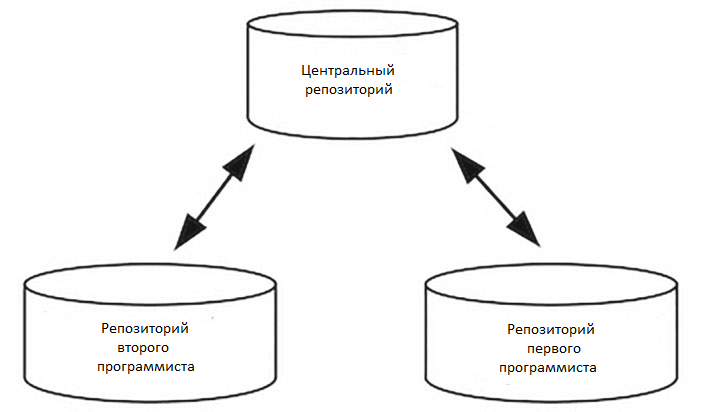

# ЧАСТЬ III Введение в инструменты программирования

<!-- TOC -->

- [ЧАСТЬ III Введение в инструменты программирования](#часть-iii-введение-в-инструменты-программирования)
    - [Глава 16. bash](#глава-16-bash)
        - [Команды](#команды)
        - [Последние команды](#последние-команды)
        - [Относительные и абсолютные пути](#относительные-и-абсолютные-пути)
        - [Навигация](#навигация)
        - [Флаги](#флаги)
        - [Скрытые файлы](#скрытые-файлы)
        - [Вертикальная черта](#вертикальная-черта)
        - [Переменные окружения](#переменные-окружения)
        - [Пользователи](#пользователи)
        - [Словарь терминов Глава 16](#словарь-терминов-глава-16)
    - [Глава 17. Регулярные выражения](#глава-17-регулярные-выражения)
        - [Простое совпадение](#простое-совпадение)
        - [Совпадение в начале и в конце](#совпадение-в-начале-и-в-конце)
        - [Поиск совпадений с несколькими символами](#поиск-совпадений-с-несколькими-символами)
        - [Совпадения цифр](#совпадения-цифр)
        - [Повторение](#повторение)
        - [Управляющие символы](#управляющие-символы)
        - [Инструмент для создания регулярных выражений](#инструмент-для-создания-регулярных-выражений)
        - [Словарь терминов Глава 17](#словарь-терминов-глава-17)
    - [Глава 18. Системы управления пакетами](#глава-18-системы-управления-пакетами)
        - [Пакеты](#пакеты)
        - [Pip](#pip)
        - [Виртуальные окружения](#виртуальные-окружения)
        - [Словарь терминов Глава 18](#словарь-терминов-глава-18)
    - [Глава 19. Управление версиями](#глава-19-управление-версиями)
        - [Репозитории](#репозитории)
        - [Помещение и извлечение данных](#помещение-и-извлечение-данных)
        - [Пример помещения данных](#пример-помещения-данных)
        - [Пример извлечения данных](#пример-извлечения-данных)
        - [Откат версий](#откат-версий)
        - [Команда `git diff`](#команда-git-diff)
        - [Дальнейшие шаги](#дальнейшие-шаги)
        - [Словарь терминов Глава 19](#словарь-терминов-глава-19)

<!-- /TOC -->

## Глава 16. bash

> Я не могу представить себе работу, которую предпочел бы компьютерному программированию. Целый день из бесформенной пустоты вы создаете шаблоны и структуры, по пути решая десятки мелких головоломок.  
> *Питер Ван Дер Линден*

Интерфейс командной строки — это программа, в которую вы вводите инструкции для выполнения вашей операционной системой. `bash` — частный случай интерфейса командной строки, и он идет в комплекте с большинством Unix-подобных операционных систем.

### Команды

Команда `echo` похожа на функцию `print` в Python.

### Последние команды

В `bash` можно просматривать последние команды, нажимая клавиши 'U+2191' (вверх) и 'U+2193' (вниз) Для просмотра списка всех последних команд воспользуйтесь командой `history`.

### Относительные и абсолютные пути

Операционная система состоит из каталогов и файлов. **Каталог** — синоним слова «папка». У всех каталогов и файлов есть путь — адрес каталога или файла в операционной системе. Когда вы используете `bash`, то всегда находитесь в каталоге с конкретным путем. Для вывода имени вашего рабочего каталога воспользуйтесь командой `pwd` (сокращение от **print working directory** — вывод рабочего каталога). Рабочий каталог — это ваш текущий каталог.

Каждая ветвь дерева, включая корень, представляет каталог. Дерево демонстрирует, как каталоги связаны друг с другом. При использовании bash вы находитесь в определенном месте в дереве вашей операционной системы. **Путь** — способ представить это место. Есть два способа представить путь к файлу или каталогу в Unix-подобной операционной системе — **абсолютный путь и относительный путь.**  
Абсолютный путь указывает на место файла или каталога начиная с корневого каталога. Абсолютный путь состоит из отделенных слешами имен каталогов в дереве в порядке приближения их к корню. Абсолютный путь к каталогу `bernie` такой: `/home/bernie`. Первый слеш представляет корневой каталог, за ним следует каталог `home`, затем еще один слеш и каталог `bernie`.
Другим способом указания места на компьютере является относительный путь. Относительный путь начинается не с корневого каталога, а с текущего рабочего каталога. Если ваш путь не начинается со слеша, `bash` понимает, что вы используете относительный путь. Если бы вы находились в каталоге `home`, относительный путь к каталогу `projects` был бы `bernie/projects`. Если бы вы находились в каталоге `home`, относительный путь к `bernie` был бы просто `bernie`. Если бы вы находились в каталоге `root`, относительный путь к `projects` был бы `home/bernie/projects`.  

### Навигация

По каталогам можно перемещаться, передавая абсолютный или относительный путь в команду `cd` в качестве параметра.  
Узнать текущее местоположение можно при помощи команды `pwd`.  
Команда `ls` выводит каталоги и папки в текущем рабочем каталоге.  
Вы можете создать новый каталог, передав имя желаемого каталога в команду `mkdir`. Имена каталогов не должны содержать пробелы.  
Чтобы перейти на один каталог выше (на один уровень выше по дереву), после команды `cd` введите **две точки.**  
Каталог можно удалить при помощи команды `rmdir`.  

### Флаги

К командам применима концепция **флаги**, которая позволяет при выполнении команды изменять ее поведение. Флаги — это опции для команд, принимающие значения `True` или `False`. По умолчанию изначальное значение всех флагов — `False`. Если вы добавите флаг к команде, bash установит значение флага равным `True`, и поведение команды изменится. Чтобы изменить флаг на `True`, перед его именем укажите один (`-`) или два (`--`) дефиса (количество дефисов зависит от используемой операционной системы). К примеру, вы можете добавить к команде `ls` флаг `–author`, чтобы присвоить флагу `author` значение `True`.

### Скрытые файлы

Ваша операционная система, а также многие программы могут хранить данные в скрытых файлах. Скрытые файлы — это файлы, которые по умолчанию не видны пользователю, поскольку их изменение может повлиять на программы, зависящие от этих файлов. Имена скрытых файлов начинаются с точки, например `.hidden`. Скрытые файлы можно просмотреть, добавив флаг `–a` (от англ. слова **all** — все) к команде `ls`.  
Команда `touch` создает новый файл.

### Вертикальная черта

В Unix-подобных операционных системах символ вертикальной черты (`|`) называют **пайп.** Вы можете использовать его для передачи вывода команды в другую команду в качестве ее ввода. Например, можно использовать вывод команды `ls` в качестве ввода команды `less`.

### Переменные окружения

**Переменные окружения** хранятся в операционной системе и используются программами для получения данных об окружении, в котором они работают, — например, об имени компьютера, на котором запущена программа, или имени пользователя операционной системы, на которой она запущена. В bash новая переменная окружения создается при помощи синтаксиса `export имя_переменной=значение_переменной`. Чтобы сослаться на переменную окружения, нужно указать перед ее именем символ `$`.  
Переменная окружения, созданная таким образом, существует лишь в окне `bash`, в котором вы ее создали. Вы можете сохранить переменную окружения, добавив ее в скрытый файл `.profile`, расположенный в каталоге `home` в Unix-подобных операционных системах. Переменная будет сохранена до тех пор, пока будет содержаться в файле `.profile`. Переменную можно удалить, стерев ее из файла `.profile`.

### Пользователи

У операционных систем может быть множество пользователей. Пользователь — человек, использующий операционную систему. Каждому пользователю присвоены имя пользователя (логин) и пароль, позволяющие ему заходить в операционную систему и работать в ней. У каждого пользователя также есть определенные разрешения — набор операций, которые им позволено выполнять. При помощи команды `whoami` можно вывести имя пользователя операционной системы.  
Обычно вы и есть тот пользователь, аккаунт которого создали при установке операционной системы. Но полномочия такого пользователя не самые широкие. Пользователь с наивысшим уровнем разрешений называется пользователем с правами `root` (пользователем root, суперпользователем). В каждой системе есть суперпользователь, который, к примеру, может создавать и удалять аккаунты других пользователей.  
По соображениям безопасности обычно вы не входите в систему как суперпользователь. Вместо этого перед командами, которые вы хотите выполнить как суперпользователь, вы добавляете команду `sudo` (от англ. словосочетания `superuser do` — выполняет суперпользователь). Ключевое слово `sudo` позволяет выполнять команды от имени суперпользователя без необходимости входа в аккаунт суперпользователя, нанося ущерб безопасности вашей операционной системы.  
Команда `sudo` снимает защитные меры, которые оберегают операционную систему от нанесения вреда, поэтому никогда не выполняйте команду с sudo, если вы до конца не уверены, что эта команда не навредит вашей операционной системе.

### Словарь терминов Глава 16

**`$PATH`:** когда вы вводите команду в bash, оболочка ищет эту команду во всех каталогах, хранящихся в переменной окружения $PATH.  
**bash:** программа, встроенная в большинство Unix-подобных операционных систем, в которую вы вводите инструкции для выполнения вашей операционной системой.  
**Абсолютный путь:** указывает на расположение файла или каталога, начиная с корневого каталога.  
**Вертикальная черта:** символ `|`. В Unix-подобных операционных системах вы можете использовать его для передачи вывода команды в другую команду в качестве ее ввода.  
**Интерфейс командной строки:** программа, в которую вы вводите инструкции для выполнения вашей операционной системой.  
**Каталог:** другое название папки на компьютере.  
**Командная строка (в Windows):** интерфейс командной строки, встроенный в операционную систему Windows.  
**Командная строка:** другое название интерфейса командной строки.  
**Относительный путь:** указывает на расположение файла или каталога, начиная с текущего рабочего каталога.  
**Переменные окружения:** переменные, в которых хранит данные операционная система, а также другие программы.  
**Пользователь:** человек, пользующийся операционной системой.  
**Путь:** способ представить место файла или каталога в операционной системе.  
**Рабочий каталог:** текущий каталог, в котором вы находитесь.  
**Разрешения:** операции, которые разрешено выполнять пользователям.  
**Суперпользователь (пользователь с правами root):** пользователь с наивысшим уровнем полномочий.

## Глава 17. Регулярные выражения

> Болтовня ничего не стоит. Покажите мне код.
> *Линус Торвальдс*

Многие языки программирования и операционные системы поддерживают **регулярные выражения** — «последовательности символов, определяющие поисковый шаблон». Регулярные выражения могут быть полезны благодаря тому, что их можно использовать для выполнения поиска по сложным запросам в файлах или иных данных. К примеру, вы можете использовать регулярное выражение для поиска всех чисел в файле.  

### Простое совпадение

Команда `grep` принимает два параметра — регулярное выражение и путь к файлу для поиска содержимого по шаблону, определенному в регулярном выражении. Простейшим видом шаблона является простое совпадение, строка слов, совпадающая с такой же строкой слов.  
Чтобы *не учитывать регистр букв*, добавьте флаг `–i`.  
По умолчанию команда grep выводит всю строку файла, в котором она нашла совпадение. Чтобы выводить только конкретные слова, совпадающие с переданным шаблоном, добавьте флаг `–o`.  
Вы можете использовать регулярные выражения в Python при помощи встроенной библиотеки `re` (от англ. словосочетания `regular expressions` — регулярные выражения). В модуле `re` есть метод `findall`. В качестве параметров в него передается регулярное выражение, затем строка, и он возвращает список со всеми элементами в строке, которые совпадают с шаблоном. Вы можете не учитывать регистр в методе `findall`. Для этого передайте в него значение `re.IGNORECASE` в качестве третьего параметра.

### Совпадение в начале и в конце

Вы можете создавать регулярные выражения со сложными шаблонами, добавив в них особые символы, которые не используются для поиска совпадения, а определяют правило. Например, для создания регулярного выражения, которое ищет шаблон, только если он встречается в начале строки, можно использовать символ каретки (`^`).  
Аналогично можно использовать символ доллара (`$`), чтобы искать совпадения только в конце строки. В Python вы должны передать значение `re.MULTILINE` в качестве третьего параметра методу `findall`, чтобы искать совпадения во всех строках многострочного экрана.

### Поиск совпадений с несколькими символами

Чтобы определить шаблон для поиска совпадений с несколькими символами, поместите эти символы внутрь квадратных скобок в регулярном выражении. Если вы укажете значение [abc], регулярное выражение будет искать совпадения с a, b или c.

### Совпадения цифр

С помощью значения `[[:digit:]]` можно искать совпадения цифр.  
В Python для этого используют ся символы `\d`.

### Повторение

Символ звездочки (`*`) добавляет в регулярные выражения повторение. При его помощи «предшествующий элемент будет найден ноль или более раз». К примеру, используя звездочку, можно найти совпадения с `this`, за которым следует любое количество букв `i`.  
В регулярных выражениях точка соответствует любому символу. Если вы укажете звездочку после точки, будет выполняться поиск совпадения с любым символом ноль или более раз. Можно использовать точку со звездочкой для поиска всего, что находится в промежутке между двумя символами.  
Регулярное выражение __.*__ находит все символы между двумя двойными подчеркиваниями, включая сами подчеркивания. Символ звездочки является **жадным** — это значит, что он попытается найти столько текста, сколько сможет.  
Не всегда нужно искать шаблоны жадным образом. Чтобы сделать регулярное выражение **нежадным**, можно указать после звездочки вопросительный знак. Нежадное регулярное выражение ищет наименьшее возможное количество совпадений. Для команды `grep` недоступен нежадный поиск, но в Python для этого можно использовать знак вопроса.  

### Управляющие символы

В регулярных выражениях вы можете экранировать символы (игнорировать их значение, просто находя совпадения) так же, как вы делали в случае со строками в Python, указывая обратный слеш `\` перед регулярным выражением.  

### Инструмент для создания регулярных выражений

Процесс создания регулярного выражения для поиска шаблона может отнимать много сил. Посетите сайты <https://regexr.com/> и <http://www.tutorialspoint.com/python/python_reg_expressions.htm> и познакомьтесь с инструментами, которые помогут вам создавать идеальные регулярные выражения.

### Словарь терминов Глава 17

**Жадный:** регулярное выражение, которое будет с жадностью пытаться найти столько совпадений, сколько сможет.  
**Нежадный:** нежадное регулярное выражение находит наименьшее количество совпадений.  
**Пасхальное яйцо:** сообщение, спрятанное в коде.  
**Регулярное выражение:** «последовательность символов, определяющая поисковый шаблон».

## Глава 18. Системы управления пакетами

> Каждый программист — это автор.
> *Серкан Лейлек*

**Система управления пакетами** (менеджер пакетов) — это программа, которая устанавливает другие программы и управляет ими. Она может быть полезна, поскольку при создании нового программного обеспечения часто приходится пользоваться другими программами. Например, веб-разработчики часто используют веб-фреймворк — программу, позволяющую создать веб-сайт. Программисты используют системы управления пакетами для установки **веб-фреймворков** и множества других программ.

### Пакеты

**Пакет** — это программное обеспечение, «упакованное» для распространения. Пакет включает файлы, из которых собственно состоит программа, и **метаданные** — информацию о данных вроде названия программного обеспечения, номера версии и **зависимостей** (программ, от которых зависит должная работа вашей программы). Для тог о чтобы загрузить и установить пакет на компьютер как программу, можно воспользоваться системой управления пакетами. Система управления пакетами управляет загрузкой всех зависимостей пакета.

### Pip

Как только вы загрузите пакет при помощи pip, вы сможете импортировать его в Python как модуль.  
Новый пакет можно установить при помощи команды `pip install имя_пакета`. Pip устанавливает новые пакеты в папку `site-packages` в вашем каталоге Python. Список всех доступных для загрузки пакетов Python вы можете найти на сайте <https://pypi.org/>. Существуют два способа указать, какой пакет вы хотите загрузить, — указав только имя пакета, или имя пакета, за которым следуют два знака равенства (`==`) и желаемый номер версии. Если вы используете только имя пакета, `pip` загрузит последнюю версию пакета. Второй вариант позволяет загрузить конкретную версию пакета вместо наиболее актуальной.  
С помощью команды `pip freeze` можно просматривать перечень установленных пакетов.  
Наконец, программу можно удалить с помощью команды `pip uninstall имя_пакета`.  

### Виртуальные окружения

В конечном итоге вам захочется устанавливать пакеты Python в виртуальное окружение вместо помещения в папку `site-packages`. Виртуальные окружения позволяют раздельно хранить пакеты Python для разных проектов. Чтобы узнать о виртуальных окружениях больше, перейдите по ссылке <https://docs.python-guide.org/dev/virtualenvs/>.

### Словарь терминов Глава 18

**`$PYTHONPATH`:** Python ищет модули в списке папок, который хранится в переменной окружения `$PYTHONPATH`.  
**Apt-get:** менеджер пакетов, который поставляется с Ubuntu.  
**Pip:** менеджер пакетов для Python.  
**PyPI:** веб-сайт, который содержит пакеты Python.  
**Site-packages:** папка в `$PYTHONPATH`. Эта папка — место, куда `pip` устанавливает пакеты.  
**Веб-фреймворк:** программа, помогающая создавать веб-сайты.  
**Виртуальное окружение:** позволяет хранить пакеты Python для разных программистских проектов раздельно.  
**Зависимости:** программы, от которых зависит должная работа программы.  
**Метаданные:** данные о данных.  
**Пакет:** программное обеспечение, «упакованное» для распространения.  
**Система у правления пакетами (менеджер пакетов):** программа, устанавливающая другие программы и управляющая ими.

## Глава 19. Управление версиями

> Я отказываюсь делать то, что могут сделать компьютеры.
> *Олин Шиверс*

**Система управления версиями** — это программа, разработанная с целью помогать вам без труда сотрудничать с другими программистами при работе над проектами. **Git** и **SVN** — популярные системы управления версиями.

### Репозитории

**Репозиторий** — это структура данных, созданная системой управления версиями, наподобие Git, которая отслеживает все изменения в программистском проекте. **Структура данных** — это способ организовывать и хранить информацию: списки и словари являются примерами структур данных.  
При работе над проектом, управляемым Git, будет создано множество репозиториев (как правило, по одному на каждого человека, принимающего участие в работе). Обычно у каждого человека, который работает над проектом, на компьютере есть репозиторий, называемый **локальным репозиторием** — он отслеживает все изменения, которые этот человек вносит в проект. Также есть **центральный репозиторий**, размещенный на веб-сайте вроде GitHub, с которым обмениваются информацией все локальные репозитории, чтобы поддерживать синхронизацию друг с другом (каждый репозиторий полностью самостоятелен). Программист, работающий над проектом, может обновлять центральный репозиторий согласно изменениям, которые он внес в свой локальный репозиторий, а также обновлять свой локальный репозиторий согласно последним изменениям, которые другие программисты внесли в центральный репозиторий. Если вы работаете над проектом с еще одним программистом, вся система будет выглядеть следующим образом.

### Помещение и извлечение данных

Прежде всего, с помощью Git вы сможете делать две вещи. Первая — обновлять свой центральный репозиторий, внося изменения из локального репозитория, то **есть помещать данные (толкать).** Вторая — обновлять свой локальный репозиторий, внося изменения из центрального репозитория, то есть **получать данные (тянуть)**.  
Команда `git remote –v` (этот часто используемый флаг служит для вывода дополнительной информации) выводит URL-адрес центрального репозитория, в который ваш локальный репозиторий помещает данные и из которого он их получает.

### Пример помещения данных

Этот процесс состоит из трех шагов. Сначала вы **индексируете** файлы — сообщаете Git, какие измененные файлы вы хотите отправить в центральный репозиторий.  
Команда `git status` отображает текущее состояние вашего проекта относительно вашего репозитория, чтобы вы могли решить, какие файлы индексировать. Эта команда выводит те файлы в локальном репозитории, которые отличаются от файлов в центральном репозитории. Когда файл не проиндексирован, он выделяется красным, когда проиндексирован — зеленым.  
При помощи синтаксиса `git reset путь_к_файлу` вы можете отменить индексацию файла , не внося изменений в центральный репозиторий.  
Как только вы проиндексировали файлы, которые хотите поместить в центральный репозиторий, можно приступать к следующему шагу, **сохранению состояния** файлов — указанию Git записывать изменения, которые вы внесли в локальный репозиторий. Это делается с помощью синтаксиса `git commit -m ваше сообщение.`  
Теперь все готово к последнему шагу. Вы можете внести изменения в свой центральный репозиторий с помощью команды `git push origin master`.

### Пример извлечения данных

В этом разделе вы обновите свой локальный репозиторий, получив изменения из центрального репозитория. Вам нужно будет делать это всякий раз, как вы захотите обновить свой локальный репозиторий согласно изменениям, которые другой программист внес в центральный репозиторий.  
Вы можете обновить локальный репозиторий согласно изменениям в вашем центральном репозитории при помощи команды `git pull origin master`.

### Откат версий

Git сохраняет ваш проект каждый раз, как вы сохраняете состояние файла. Вы можете откатиться к любому предыдущему состоянию — «отмотать назад» свой проект. К примеру, можно вернуть проект к состоянию, сделанному на прошлой неделе. Все ваши файлы и папки останутся такими же, какими они были на прошлой неделе. Тогда вы можете перепрыгнуть к более свежему состоянию. У каждого состояния есть **номер** — уникальная последовательность символов, используемая Git для идентификации состояния.  
Вы можете просмотреть историю состояний вашего проекта с помощью команды `git log`, выводящей все состояния. Вы можете изменить состояние вашего проекта, передав номер состояния в качестве параметра команде `git checkout`.

### Команда `git diff`

Команда `git diff` демонстрирует разницу между файлом в локальном и в центральном репозитории.

### Дальнейшие шаги

В этой главе я описал возможности Git, которыми вы будете пользоваться чаще всего. Как только вы освоите базовые понятия, я советую посвятить время изучению продвинутых возможностей Git, таких как ветвление и слияние, на сайте <https://www.pluralsight.com/courses/mastering-git>.

### Словарь терминов Глава 19

**Git:** популярная система управления версиями.  
**GitHub:** веб-сайт, хранящий код в облаке.  
**SVN:** популярная система управления версиями.  
**Извлечение данных:** обновление локального репозитория согласно изменениям в центральном репозитории.  
**Индексирование:** указание Git, какие файлы (с изменениями) следует поместить в центральный репозиторий.  
**Кодовая база:** папки и файлы, из которых формируется ваше программное обеспечение.  
**Локальный репозиторий:** репозиторий на вашем компьютере.  
**Номер состояния:** уникальная последовательность символов, используемая Git для идентификации состояния.  
**Помещение данных:** обновление центрального репозитория согласно изменениям в локальном репозитории.  
**Репозиторий:** структура данных, созданная системой управления версиями, наподобие Git, которая отслеживает все изменения в вашем программистском проекте.  
**Система управления версиями:** программа, разработанная с целью помогать вам без труда работать над проектами совместно с другими программистами.  
**Состояние:** версия вашего проекта, сохраняемая Git.  
**Сохранение состояния:** написание команды, указывающей Git записывать изменения, которые вы внесли в свой репозиторий.  
**Структура данных:** способ организовывать и хранить информацию. Списки и словари являются примерами структур данных.  
**Центральный репозиторий:** репозиторий, размещенный на веб-сайте вроде GitHub, с которым обмениваются информацией все локальные репозитории для поддержания синхронизации друг с другом.