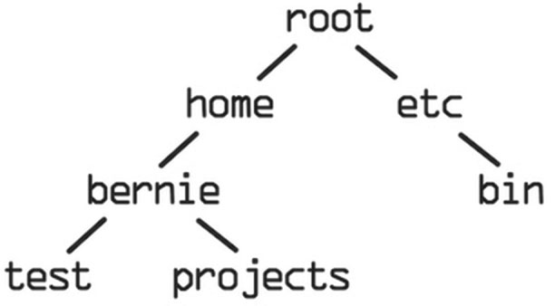

# ЧАСТЬ III Введение в инструменты программирования

<!-- TOC -->

- [ЧАСТЬ III Введение в инструменты программирования](#часть-iii-введение-в-инструменты-программирования)
    - [Глава 16. bash](#глава-16-bash)
        - [Команды](#команды)
        - [Последние команды](#последние-команды)
        - [Относительные и абсолютные пути](#относительные-и-абсолютные-пути)
        - [Навигация](#навигация)
        - [Флаги](#флаги)
        - [Скрытые файлы](#скрытые-файлы)
        - [Вертикальная черта](#вертикальная-черта)
        - [Переменные окружения](#переменные-окружения)
        - [Пользователи](#пользователи)
        - [Словарь терминов Глава 16](#словарь-терминов-глава-16)

<!-- /TOC -->

## Глава 16. bash

> Я не могу представить себе работу, которую предпочел бы компьютерному программированию. Целый день из бесформенной пустоты вы создаете шаблоны и структуры, по пути решая десятки мелких головоломок.  
> *Питер Ван Дер Линден*

Интерфейс командной строки — это программа, в которую вы вводите инструкции для выполнения вашей операционной системой. `bash` — частный случай интерфейса командной строки, и он идет в комплекте с большинством Unix-подобных операционных систем.

### Команды

Команда `echo` похожа на функцию `print` в Python.

### Последние команды

В `bash` можно просматривать последние команды, нажимая клавиши 'U+2191' (вверх) и 'U+2193' (вниз) Для просмотра списка всех последних команд воспользуйтесь командой `history`.

### Относительные и абсолютные пути

Операционная система состоит из каталогов и файлов. **Каталог** — синоним слова «папка». У всех каталогов и файлов есть путь — адрес каталога или файла в операционной системе. Когда вы используете `bash`, то всегда находитесь в каталоге с конкретным путем. Для вывода имени вашего рабочего каталога воспользуйтесь командой `pwd` (сокращение от **print working directory** — вывод рабочего каталога). Рабочий каталог — это ваш текущий каталог.

Каждая ветвь дерева, включая корень, представляет каталог. Дерево демонстрирует, как каталоги связаны друг с другом. При использовании bash вы находитесь в определенном месте в дереве вашей операционной системы. **Путь** — способ представить это место. Есть два способа представить путь к файлу или каталогу в Unix-подобной операционной системе — **абсолютный путь и относительный путь.**  
Абсолютный путь указывает на место файла или каталога начиная с корневого каталога. Абсолютный путь состоит из отделенных слешами имен каталогов в дереве в порядке приближения их к корню. Абсолютный путь к каталогу `bernie` такой: `/home/bernie`. Первый слеш представляет корневой каталог, за ним следует каталог `home`, затем еще один слеш и каталог `bernie`.
Другим способом указания места на компьютере является относительный путь. Относительный путь начинается не с корневого каталога, а с текущего рабочего каталога. Если ваш путь не начинается со слеша, `bash` понимает, что вы используете относительный путь. Если бы вы находились в каталоге `home`, относительный путь к каталогу `projects` был бы `bernie/projects`. Если бы вы находились в каталоге `home`, относительный путь к `bernie` был бы просто `bernie`. Если бы вы находились в каталоге `root`, относительный путь к `projects` был бы `home/bernie/projects`.  

### Навигация

По каталогам можно перемещаться, передавая абсолютный или относительный путь в команду `cd` в качестве параметра.  
Узнать текущее местоположение можно при помощи команды `pwd`.  
Команда `ls` выводит каталоги и папки в текущем рабочем каталоге.  
Вы можете создать новый каталог, передав имя желаемого каталога в команду `mkdir`. Имена каталогов не должны содержать пробелы.  
Чтобы перейти на один каталог выше (на один уровень выше по дереву), после команды `cd` введите **две точки.**  
Каталог можно удалить при помощи команды `rmdir`.  

### Флаги

К командам применима концепция **флаги**, которая позволяет при выполнении команды изменять ее поведение. Флаги — это опции для команд, принимающие значения `True` или `False`. По умолчанию изначальное значение всех флагов — `False`. Если вы добавите флаг к команде, bash установит значение флага равным `True`, и поведение команды изменится. Чтобы изменить флаг на `True`, перед его именем укажите один (`-`) или два (`--`) дефиса (количество дефисов зависит от используемой операционной системы). К примеру, вы можете добавить к команде `ls` флаг `–author`, чтобы присвоить флагу `author` значение `True`.

### Скрытые файлы

Ваша операционная система, а также многие программы могут хранить данные в скрытых файлах. Скрытые файлы — это файлы, которые по умолчанию не видны пользователю, поскольку их изменение может повлиять на программы, зависящие от этих файлов. Имена скрытых файлов начинаются с точки, например `.hidden`. Скрытые файлы можно просмотреть, добавив флаг `–a` (от англ. слова **all** — все) к команде `ls`.  
Команда `touch` создает новый файл.

### Вертикальная черта

В Unix-подобных операционных системах символ вертикальной черты (`|`) называют **пайп.** Вы можете использовать его для передачи вывода команды в другую команду в качестве ее ввода. Например, можно использовать вывод команды `ls` в качестве ввода команды `less`.

### Переменные окружения

**Переменные окружения** хранятся в операционной системе и используются программами для получения данных об окружении, в котором они работают, — например, об имени компьютера, на котором запущена программа, или имени пользователя операционной системы, на которой она запущена. В bash новая переменная окружения создается при помощи синтаксиса `export имя_переменной=значение_переменной`. Чтобы сослаться на переменную окружения, нужно указать перед ее именем символ `$`.  
Переменная окружения, созданная таким образом, существует лишь в окне `bash`, в котором вы ее создали. Вы можете сохранить переменную окружения, добавив ее в скрытый файл `.profile`, расположенный в каталоге `home` в Unix-подобных операционных системах. Переменная будет сохранена до тех пор, пока будет содержаться в файле `.profile`. Переменную можно удалить, стерев ее из файла `.profile`.

### Пользователи

У операционных систем может быть множество пользователей. Пользователь — человек, использующий операционную систему. Каждому пользователю присвоены имя пользователя (логин) и пароль, позволяющие ему заходить в операционную систему и работать в ней. У каждого пользователя также есть определенные разрешения — набор операций, которые им позволено выполнять. При помощи команды `whoami` можно вывести имя пользователя операционной системы.  
Обычно вы и есть тот пользователь, аккаунт которого создали при установке операционной системы. Но полномочия такого пользователя не самые широкие. Пользователь с наивысшим уровнем разрешений называется пользователем с правами `root` (пользователем root, суперпользователем). В каждой системе есть суперпользователь, который, к примеру, может создавать и удалять аккаунты других пользователей.  
По соображениям безопасности обычно вы не входите в систему как суперпользователь. Вместо этого перед командами, которые вы хотите выполнить как суперпользователь, вы добавляете команду `sudo` (от англ. словосочетания `superuser do` — выполняет суперпользователь). Ключевое слово `sudo` позволяет выполнять команды от имени суперпользователя без необходимости входа в аккаунт суперпользователя, нанося ущерб безопасности вашей операционной системы.  
Команда `sudo` снимает защитные меры, которые оберегают операционную систему от нанесения вреда, поэтому никогда не выполняйте команду с sudo, если вы до конца не уверены, что эта команда не навредит вашей операционной системе.

### Словарь терминов Глава 16

**$PATH:** когда вы вводите команду в bash, оболочка ищет эту команду во всех каталогах, хранящихся в переменной окружения $PATH.  
**bash:** программа, встроенная в большинство Unix-подобных операционных систем, в которую вы вводите инструкции для выполнения вашей операционной системой.  
**Абсолютный путь:** указывает на расположение файла или каталога, начиная с корневого каталога.  
**Вертикальная черта:** символ `|`. В Unix-подобных операционных системах вы можете использовать его для передачи вывода команды в другую команду в качестве ее ввода.  
**Интерфейс командной строки:** программа, в которую вы вводите инструкции для выполнения вашей операционной системой.  
**Каталог:** другое название папки на компьютере.  
**Командная строка (в Windows):** интерфейс командной строки, встроенный в операционную систему Windows.  
**Командная строка:** другое название интерфейса командной строки.  
**Относительный путь:** указывает на расположение файла или каталога, начиная с текущего рабочего каталога.  
**Переменные окружения:** переменные, в которых хранит данные операционная система, а также другие программы.  
**Пользователь:** человек, пользующийся операционной системой.  
**Путь:** способ представить место файла или каталога в операционной системе.  
**Рабочий каталог:** текущий каталог, в котором вы находитесь.  
**Разрешения:** операции, которые разрешено выполнять пользователям.  
**Суперпользователь (пользователь с правами root):** пользователь с наивысшим уровнем полномочий.